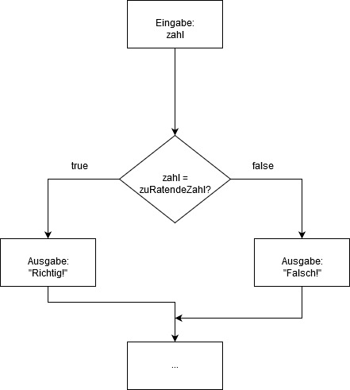

#Einfache Verzweigungen 

Programme müssen in vielen Situationen selbst entscheiden, was sie weiter tun sollen. Die weitere Verarbeitung von Anweisungen hängt dann vom Zutreffen einer oder mehrerer Bedingungen ab. Ein Beispiel wäre ein kleines Rateprogramm, in dem der Benutzer eine Zahl zwischen 1 und 10 erraten muss. Gibt er die richtige Zahl ein, gibt das Programm „Richtig“ aus. Gibt er eine falsche Zahl ein, so ist das Ergebnis „Falsch geraten“. Das Verhalten des Programms ist also von der Beantwortung der Frage „Ist die eingegebene Zahl richtig?“ abhängig:




So eine Verzweigung innerhalb eines Programms wird in Java mittels einer If-Anweisung gelöst:

```
public class GuessGame{
	public static void main(String args[]){
	    int numberToGuess, input;
 	    Scanner sc = new Scanner(System.in);
	    numberToGuess = 6;
	    System.out.print("Gib eine Zahl zwischen 1 und 10 ein: ");
	    input = sc.nextInt();
	    if (input = = numberToGuess) 
                System.out.println("Richtig!");
	    else 
                System.out.println("Falsch geraten!");
	}
}
```
###Syntax der if-Anweisung:

-	Die if-Anweisung beginnt mit dem reservierten Wort if.
-	Dahinter wird eine Testbedingung als Ausdruck formuliert. Dieser wird in runde Klammern eingeschlossen. Der formulierte Ausdruck gibt einen Wert vom Typ boolean  zurück. Der Testbedingung folgt kein Semikolon.
-	Liefert die Auswertung des Ausdrucks den Wert true, ist die Bedingung wahr, wird die folgende Anweisung ausgeführt.
-	Nach der if-Bedingung und dem Anweisungsteil folgt das Schlüsselwort else. Trifft die Bedingung in der if-Anweisung nicht zu (Ausdruck liefert false), wird der Anweisungsteil nach else ausgeführt.
-	Folgen hinter if und else mehrere Anweisungen, müssen diese in geschweifte Klammern gesetzt werden. Man sagt, die Anweisungen werden in einem Block zusammengefasst.
-	Der else-Zweig kann auch weggelassen werden. Liefert in einem solchen Fall der Ausdruck den Wert false – falsch, wird die der if-Anweisung folgende Anweisung übersprungen.

Die allgemeine Struktur einer Verzweigung sieht also wie folgt aus:
```
if (Ausdruck) {
    Anweisung1;
    Anweisung2;
}
else {
    Anweisung3;
    Anweisung4;
}
```

###Der Bedingungsoperator ?

Mithilfe des Bedingungsoperators können Verzweigungen verkürzt dargestellt werden. In einem Programm wird beispielsweise zur weiteren Verarbeitung das Maximum zweier Zahlen benötigt. Dann kann der erste Ausdruck durch den zweiten ersetzt werden:

```
1. 
if(a>b)
     maximum = a;
else
     maximum = b;

2.
maximum = (a>b) ? a : b;
```
