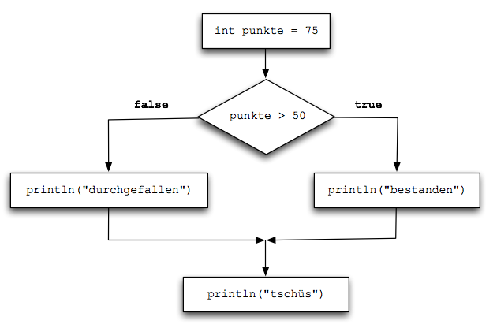

# Lernfeld 5 - IF-Anweisungen

Folgende Aufgaben sind enthalten
* [getMaximum](./src/getMaximum/task.md)
* [calculator](./src/calculator/task.md)
* [maexchen](./src/maexchen/task.md)
* [dateValidation](./src/dateValidation/task.md)
* [gradesWithIHKScheme](./src/gradesWithIHKScheme/task.md)
* [discount](./src/discount/task.md)
* [tyre pressure](./src/tyre_pressure/task.md)

