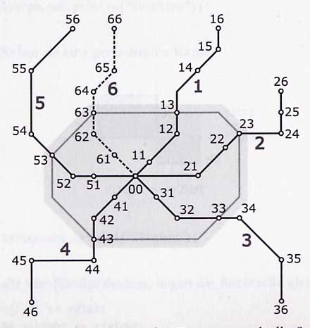

#S-Bahn in Byteburg***
Das S-Bahn-Netz von Byteburg ist regelmäßig aufgebaut. Es gibt fünf Hauptlinien (1 bis 5) und eine Ringlinie. Linie 6 befindet sich im Bau und wird noch nicht benutzt. Die Stationen entlang der Hauptlinien sind von innen nach außen mit 1 bis 6 durchnummeriert. Im Zentrum liegt Station 00. Die Ringlinie verbindet reihum die Stationen 3 der Hauptlinien.
Die Stationen sind mit einem zweistelligen Code benannt: Die Zehnerstelle nennt die Linie, die Einerstelle die Stationsnummer, wie in der folgenden Skizze gezeigt:



Im Innenraum (grau hinterlegt) liegen das Zentrum und alle Stationen bis einschließlich der Ringlinie. Die übrigen Stationen liegen im Außenraum.

Es soll ein Programm implementiert werden, das die Fahrpreise nach folgenden Regeln berechnet:

1. Eine Fahrt kostet 2 € (z.B. von 11 nach 13).
2. Jede überquerte Zonengrenze kostet zusätzlich 1 € (z.B. von 11 nach 14: 2 € + 1 € = 3 €).
3. Jede benutzte Endstation kostet zusätzlich 1 € (z.B. 16 nach 11).
4. Eine Fahrt zwischen zwei benachbarten Stationen kostet immer 1 €, auch wenn eine Zonengrenze dazwischen liegt oder eine Endstation benutzt wird (z.B. von 13 nach 14, von 15 nach 16 oder von 13 nach 53: jeweils 1€). 

Beachte, dass nach Linie 6 auch noch weitere Hauptlinien geplant sind mit jeweils 6 Stationen, die die Ringlinie an Station 3 schneiden. Auch nach Ausbauten bleiben die Hauptlinien im Uhrzeigersinn fortlaufend durchnummeriert. **Dein Programm soll mit möglichst wenig Aufwand für die erweiterten Streckennetze anpassbar sein.**

###Aufgaben

1. Implementiere in der Klasse `TicketCalculator` die Methode `public int calculateTicketprice(int startRailwayStation, int exitRailwayStation)`. Sie gibt den Preis zurück, den der Fahrgast für die jeweilige Strecke von startRailwayStation nach exitRailwayStation bezahlen muss. **Wird der Methode eine nicht existierende Bahnstation übergeben, gibt die Methode -1 zurück.** 
Da sehr viele Fälle beachtet und implementiert werden müssen, wird der Quellcode sehr unleserlich, wenn er einfach in die oben genannte Methode eingefügt wird. Teile daher deinen Quellcode in mehrere Methoden auf, so dass die Hauptmethode  `public int calculateTicketprice(int startRailwayStation, int exitRailwayStation)` die implementierten  Methoden aufruft und zur Gesamtlösung zusammensetzt! **Beachte dabei den Grundsatz, dass eine Methode nur für eine Aufgabe zuständig sein soll.** Da es sich dabei um Hilfsmethoden innerhalb der Klasse `TicketCalculator` handelt, die ein Client nicht von außen aufrufen soll, deklariere sie mit dem Modifizierer `private` statt `public`. Zur Lösung des Problems benötigst du eine **Konstante**. Lies daher den Abschnitt **Tipp** weiter unten, bevor du anfängst.
2. Schreibe eine UI-Klasse, in der der Benutzer über die Konsole Start- und ZielBahnhof eingibt und den zu zahlenden Preis angezeigt bekommt.

**Beispiel:**

```
von: 11
nach: 13
Preis: 2
```

**Tipp**

In deinen Programmen hast du bisher nur Variablen benutzt, die sich zur Laufzeit ändern. Es gibt allerdings auch Variablen, die zum Beginn des Programms einen Wert zugewiesen bekommen und sich dann nicht mehr ändern. Beispiele für solche **Konstanten** könnten etwa die Anzahl der Räder eines Autos oder die Startzeit der Tagesschau sein. Diese Werte sollten nicht wiederholt im Quellcode stehen, sondern über ihre Namen angesprochen werden. Konstanten werden wie folgt definiert:

```
public class Example{
    final static int WHEELNUMBER = 4;

    public void foo(){
    ...
    }
```
Bezeichner von Konstanten werden der Konvention nach in Großbuchstaben geschrieben, um sie von normalen Variablen zu unterscheiden. Im Beispiel oben wurde die Konstante innerhalb der Klasse, aber außerhalb einer Methode definiert, so dass alle Methoden der Klasse auf die Konstante zugreifen können. 
